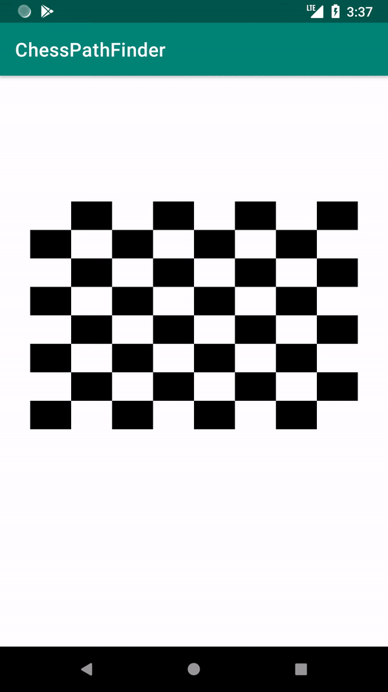

# ChessPathFinder
A Android application which calculates all possible paths that a chess piece can take, between a starting and an ending point with a maximum number of moves e.g. 3, and draws them using different colors on a recyclerview board.  

  

## Libraries
* Architecture components
  * LiveData
  * ViewModel
* RxJava2
* Dagger2
* Mockito
* Mockito-Kotlin
* Robolectric
